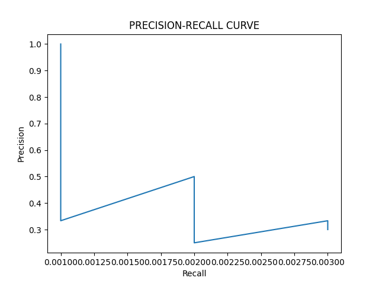
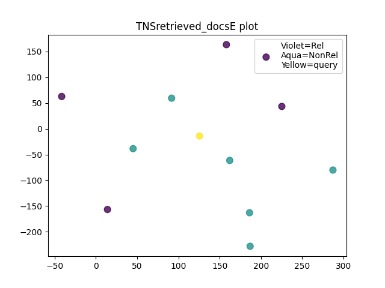
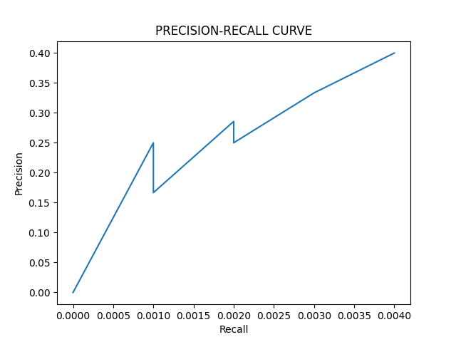
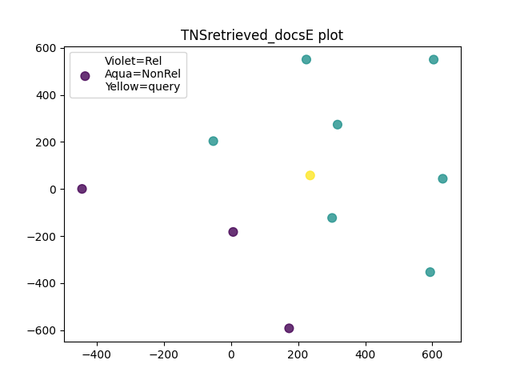

# Information Retrieval Project Overview

This project aims to develop a search engine using a vector space model. The project comprises two main modules for text preprocessing and information retrieval, along with a web scraping script for data collection.

## Preprocessing

The preprocessing module includes functions for text cleaning, tokenization, stop-word removal, lemmatization, and number-to-word conversion. These processes ensure the input data is suitably formatted for creating the vector space model.

## Vector Space Model

The vector space model module implements a basic information retrieval system. It builds an inverted index, computes term frequencies (TF) and document frequencies (DF), and calculates TF-IDF scores. The module also offers functionality for similarity computation, document ranking, and relevance feedback. Visualization tools, such as T-SNE plots, aid in understanding document clusters.

## Web Scraping

The web scraping script utilizes Selenium for extracting information about tourist attractions from the Incredible India website (https://www.incredibleindia.org). Attraction details are saved in separate text files, allowing the retrieval system to use this information.

## Usage

1. *Preprocessing:*

   Import the preprocessing module and use its functions:

   python
   from preprocessing_module import *

   ### Example usage:
   data = preprocess_text(your_text_data)
   tokens = tokenize_and_lemmatize(data)
   

2. *Vector Space Model:*

   Import the vector space model module and execute relevant functions:

   python
   from vector_space_model import *

   ### Example usage:
   query = "your_search_query"
   retrieve_results(query)
   

3. *Web Scraping:*

   Ensure Selenium and BeautifulSoup are installed:

   bash
   pip install selenium beautifulsoup4
   

   Run the web scraping script:

   bash
   python web_scraping_script.py
   

   Note: Adjustments to the scraping script may be needed based on website changes.

## Dependencies

- nltk
- num2words
- scikit-learn
- matplotlib
- beautifulsoup4
- selenium

Install dependencies using:

bash
pip install nltk num2words scikit-learn matplotlib beautifulsoup4 selenium

## Contributors

- Sampreeth
- Balarajaiah

Iteration-1
 

Iteration-2
 

<!-- <table>
<th>Results for Iteration-1</th>
<tr>
  <td></td> 
  <td></td>
</tr>
</table>

<table>
<th>Results for Iteration-2</th>
<tr>
  <td></td> 
  <td></td>
</tr>
</table> -->